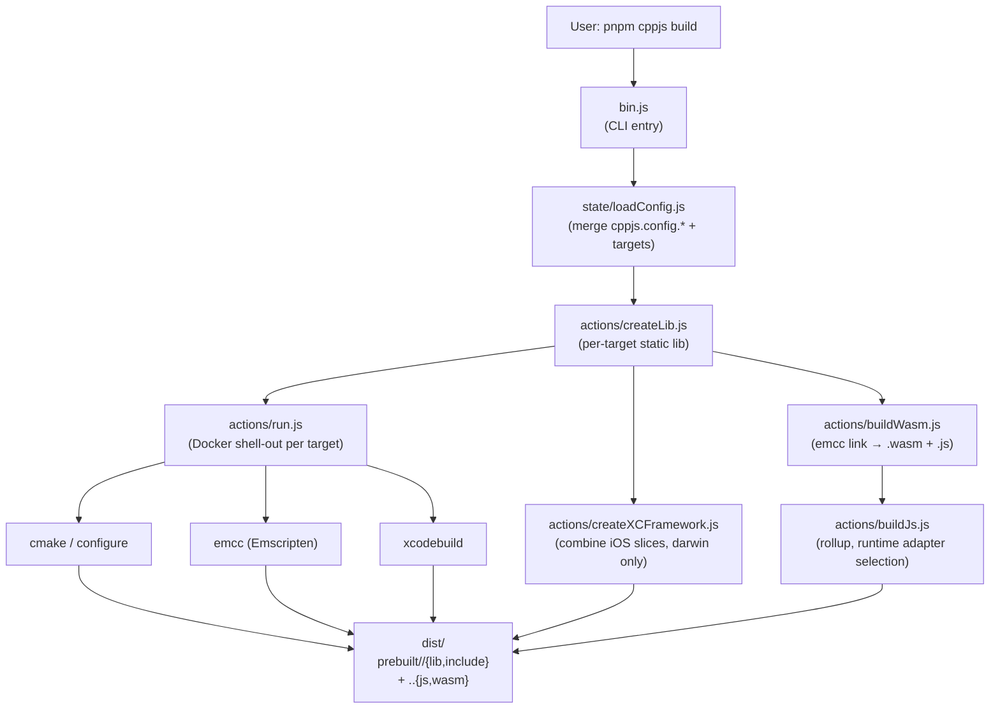
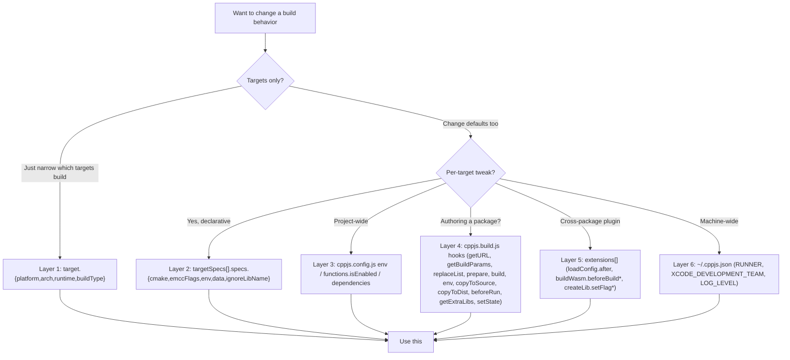
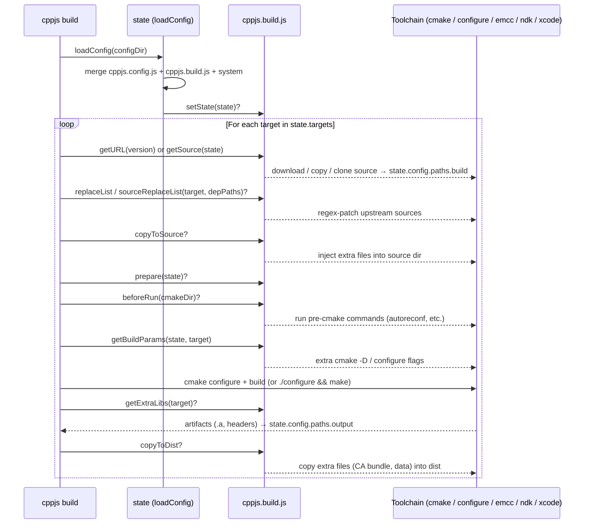

# cpp.js — Architecture

> One-page mental model for AI agents and contributors. Pair with `CODEMAP.md` to find concrete files.

## High-level flow



## Key abstractions

### Targets (the unit of build work)

A **target** is a `{platform, arch, runtime, runtimeEnv, buildType}` tuple — e.g. `wasm-wasm32-mt-release-browser` or `ios-iphoneos-mt-release`. The full matrix lives in `cppjs-core/cpp.js/src/state/index.js`. CLI flags (`-p`, `-a`, `-r`, `-e`, `-b`) filter which targets actually build; defaults try the full matrix that the host can support.

### Runtime adapters (JS layer)

The user-facing JavaScript loader is composed from a shared `core.js` plus thin per-environment shims under `cppjs-core/cpp.js/src/assets/js-runtime/`:

```
js-runtime/
├── core.js                 ← createInitCppJs, mergeDeep, locateFile, preRun, …
├── browser.js              ← thin shim: pick adapters
├── node.js                 ← same shape
├── edge.js                 ← same shape
└── adapters/
    ├── path-url.js         ← URL-style locateFile (browser)
    ├── path-fs.js          ← fs path locateFile (node, edge) — factory
    ├── fs-browser.js       ← OPFS, autoMountFiles, _createVector
    ├── fs-node.js          ← getPreloadedPackage, FS.readFile helpers
    └── worker-comlink.js   ← Comlink + Embind bridge for browser workers
```

Adding a new runtime (e.g. Deno) ≈ writing one `<runtime>.js` shim that composes the right adapters.

### C++ runtime (native bridge)

`cppjs-core/cpp.js/src/assets/cpp-runtime/` holds the C++ side: `browser.cpp`, `node.cpp`, `commonBridges.cpp`, `cppjsEmptySource.cpp`. These get linked by `buildWasm` along with the user's library and any package's `bridge` outputs.

### Plugins (bundler integrations)

Each `cppjs-plugins/cppjs-plugin-*` adapts cpp.js's outputs to one bundler. They share a small contract:

- Watch native source dirs (`paths.native`) so bundler HMR triggers `createLib`/`buildWasm` rebuilds.
- Pipe `/cpp.js`, `/cpp.wasm`, `/cpp.data.txt` requests to dev-server middleware.
- Set COOP/COEP headers when multithread is in use.

`cppjs-plugin-rollup` is the inner kernel; `cppjs-plugin-vite` wraps it; `cppjs-plugin-webpack` is parallel; `cppjs-plugin-react-native` + `cppjs-plugin-metro` handle RN.

### Packages (prebuilt C++ libs)

A `cppjs-package-X` family is a meta package + per-arch sub-packages:

```
cppjs-packages/cppjs-package-zlib/
├── cppjs-package-zlib/             ← meta package, depends on the three sub-packages
├── cppjs-package-zlib-wasm/        ← wasm prebuilt + cppjs.config.js + cppjs.build.js
├── cppjs-package-zlib-android/
└── cppjs-package-zlib-ios/
```

Sub-packages declare workspace deps to other `@cpp.js/package-*-<arch>` they need (e.g. `gdal-wasm` lists `proj-wasm`, `tiff-wasm`, …); pnpm derives topological build order from this.

### Samples (canonical integrations)

`cppjs-samples/` doubles as documentation. When integrating cpp.js into a new framework, agents should diff against the closest matching sample first. Two samples are agent-canonical:

- `cppjs-sample-mobile-reactnative-cli/` — RN-cli reference, with CI bridge fixtures under `ci/cppjs-snapshot/`.
- `cppjs-sample-lib-prebuilt-matrix/` — minimal C++ library packaging reference (no UI).

## Persistence + caching

- **`<project>/.cppjs/`** — per-project build cache (cmake outputs, bridge files). Safe to delete; rebuilt on next `cppjs build`.
- **`<project>/dist/prebuilt/<target>/`** — package output (consumed by other packages). Treated as authoritative once written; `createLib` / `buildWasm` short-circuit when artifacts exist unless `force` is set.
- **`<project>/dist/<name>.*.{js,wasm,data.txt}`** — final consumer artifacts.

Force semantics: `actions/isSourceNewer.js` compares native source mtimes against the artifact mtime. Plugins and the CLI use this to decide when to bypass the "already built" cache. Manually overriding requires `{ force: true }` on `createLib` / `buildWasm` calls.

## Execution boundaries (Docker, Xcode, Emscripten)

`actions/run.js` shells out to host tools. WASM and Android targets run inside a Docker image (`getDockerImage()`); iOS targets need a darwin host with Xcode installed. The wasm/android branches are CI-friendly on Linux runners; iOS branches early-return on non-darwin (`createLib.js:18`, `createXCFramework.js:13`).

## Logger + diagnostics

Build output is funneled through `cppjs-core/cpp.js/src/utils/logger.js` (`log-update` + `picocolors`). Step lines update in place when the terminal is a TTY; non-TTY (CI, pipe) falls back to plain newline output. Errors and rollup warnings unrelated to host code (Node builtins) are suppressed in `actions/buildJs.js`.

## Override hierarchy (where do I tweak X?)



Reach for the **highest** layer that solves the problem (least invasive). See [`docs/api/overrides.md`](./api/overrides.md) for the full catalog.

## `cppjs.build.js` lifecycle (package authors)



See [`docs/api/cppjs-build.md`](./api/cppjs-build.md) for hook signatures.

## Where to look next

- "I want to add a feature to the build pipeline" → `cppjs-core/cpp.js/AGENTS.md`
- "I want to support a new bundler" → write a new `cppjs-plugins/cppjs-plugin-*`; mirror `plugin-vite` or `plugin-webpack`
- "I want to wrap a new C++ library" → `docs/playbooks/new-package.md`
- "I want to integrate cpp.js into my own app" → `docs/playbooks/integration/README.md`
- "I want a concrete pointer to a specific concept" → `docs/CODEMAP.md`
