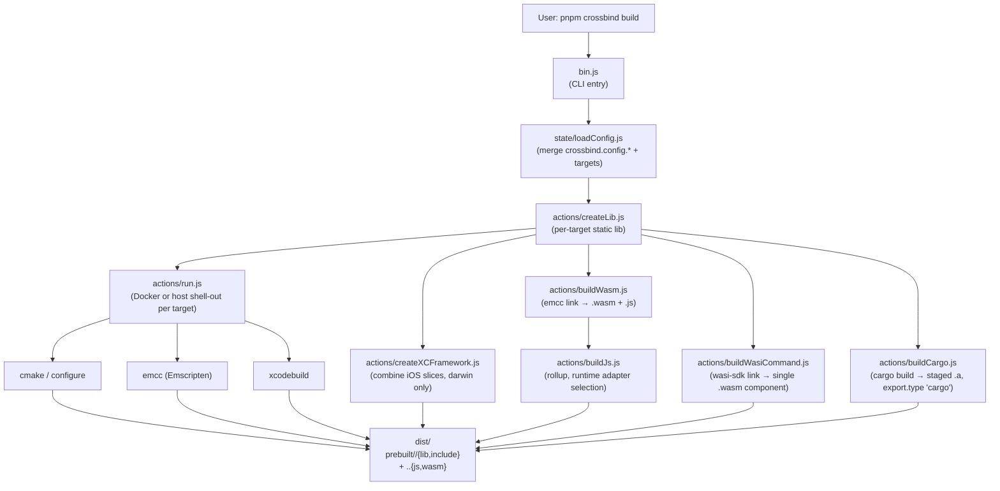
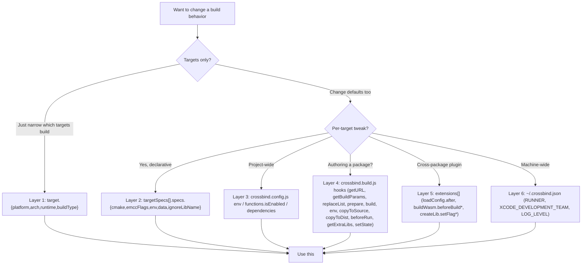
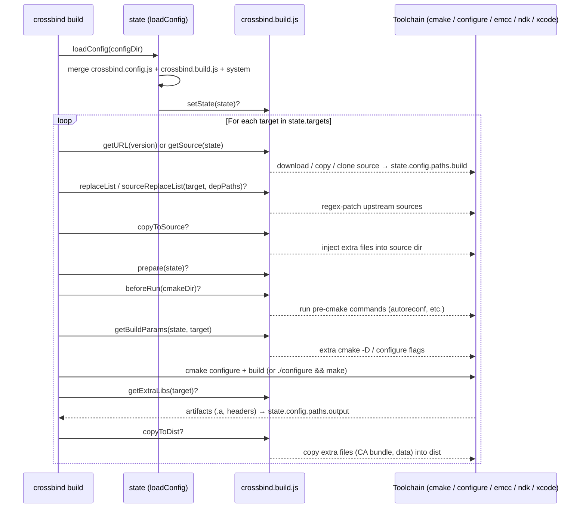

# crossbind — Architecture

> One-page mental model for AI agents and contributors. Pair with `CODEMAP.md` to find concrete files.

## High-level flow


```mermaid
flowchart TD
    User["User: pnpm crossbind build"]
    Bin["bin.js<br/>(CLI entry)"]
    State["state/loadConfig.js<br/>(merge crossbind.config.* + targets)"]
    BuildLib["actions/createLib.js<br/>(per-target static lib)"]
    XCFwk["actions/createXCFramework.js<br/>(combine iOS slices, darwin only)"]
    BuildWasm["actions/buildWasm.js<br/>(emcc link → .wasm + .js)"]
    BuildWasi["actions/buildWasiCommand.js<br/>(wasi-sdk link → single .wasm component)"]
    BuildCargo["actions/buildCargo.js<br/>(cargo build → staged .a, export.type 'cargo')"]
    BuildJs["actions/buildJs.js<br/>(rollup, runtime adapter selection)"]
    Run["actions/run.js<br/>(Docker or host shell-out per target)"]
    Cmake["cmake / configure"]
    Emcc["emcc (Emscripten)"]
    Xcode["xcodebuild"]
    Dist["dist/<br/>prebuilt/<target>/{lib,include}<br/>+ <name>.<runtimeEnv>.{js,wasm}"]

    User --> Bin
    Bin --> State
    State --> BuildLib
    BuildLib --> Run
    BuildLib --> XCFwk
    BuildLib --> BuildWasm
    BuildLib --> BuildWasi
    BuildLib --> BuildCargo
    BuildWasm --> BuildJs
    Run --> Cmake
    Run --> Emcc
    Run --> Xcode
    Cmake --> Dist
    Emcc --> Dist
    Xcode --> Dist
    XCFwk --> Dist
    BuildJs --> Dist
    BuildWasi --> Dist
    BuildCargo --> Dist
```

## Key abstractions

### Targets (the unit of build work)

A **target** is a `{platform, arch, runtime, runtimeEnv, buildType}` tuple — e.g. `wasm-wasm32-mt-release-browser`, `wasi-wasm32-st-release` or `ios-iphoneos-mt-release`. The inventory's single source is `core/crossbind/src/utils/targets.js` (state and the wasi command runner both read it). CLI flags (`-p`, `-a`, `-r`, `-e`, `-b`) filter which targets actually build; defaults try the full matrix that the host can support.

### Runtime adapters (JS layer)

The user-facing JavaScript loader is composed from a shared `core.js` plus thin per-environment shims under `core/crossbind/src/assets/js-runtime/`:

```
js-runtime/
├── core.js                 ← createInitCrossbind, mergeDeep, locateFile, preRun, …
├── browser.js              ← thin shim: pick adapters
├── node.js                 ← same shape
├── edge.js                 ← same shape
└── adapters/
    ├── path-url.js         ← URL-style locateFile (browser)
    ├── path-fs.js          ← fs path locateFile (node, edge) — factory
    ├── fs-browser.js       ← OPFS, autoMountFiles, _createVector
    ├── fs-node.js          ← getPreloadedPackage, FS.readFile helpers
    └── worker-comlink.js   ← Comlink + Embind bridge for browser workers
```

Adding a new runtime (e.g. Deno) ≈ writing one `<runtime>.js` shim that composes the right adapters.

### C++ runtime (native bridge)

`core/crossbind/src/assets/cpp-runtime/` holds the C++ side: `browser.cpp`, `node.cpp`, `commonBridges.cpp`, `crossbindEmptySource.cpp`. These get linked by `buildWasm` along with the user's library and any package's `bridge` outputs.

### Plugins (bundler integrations)

Each `plugins/*` adapts crossbind's outputs to one bundler. They share a small contract:

- Watch native source dirs (`paths.native`) so bundler HMR triggers `createLib`/`buildWasm` rebuilds.
- Pipe `/crossbind.js`, `/crossbind.wasm`, `/crossbind.data.txt` requests to dev-server middleware.
- Set COOP/COEP headers when multithread is in use.

`plugins/rollup` is the inner kernel; `plugins/vite` wraps it; `plugins/webpack` is parallel; `plugins/react-native` + `plugins/metro` handle RN.

### Packages (prebuilt C++ libs)

A `ports/<X>` family is a base package + per-arch sub-packages:

```
ports/zlib/
├── base/       ← brand package: recipe body (build.mjs) + upstream license truth
├── wasm/       ← per-platform prebuilt + crossbind.config.js + crossbind.build.js
├── android/
├── ios/
└── wasi/       ← wasi (wasm32-wasip3) prebuilt
```

Sub-packages declare workspace deps to other `@crossbind/port-*-<arch>` they need (e.g. `gdal-wasm` lists `proj-wasm`, `tiff-wasm`, …); pnpm derives topological build order from this. Where the upstream ships CLI tools, a `bin-wasi/` sibling publishes them as npm commands; everything those packages ship (tool map, NOTICE/SBOM, provenance, license field) is derived under the Bin & License Contract — `ports/README.md`.

### Samples (canonical integrations)

`examples/` doubles as documentation. When integrating crossbind into a new framework, agents should diff against the closest matching sample first. Two samples are agent-canonical:

- `examples/mobile-reactnative-cli/` — RN-cli reference, with CI bridge fixtures under `ci/crossbind-snapshot/`.
- `examples/lib-prebuilt-matrix/` — minimal C++ library packaging reference (no UI).

## Persistence + caching

- **`<project>/.crossbind/`** — per-project build cache (cmake outputs, bridge files). Safe to delete; rebuilt on next `crossbind build`.
- **`<project>/dist/prebuilt/<target>/`** — package output (consumed by other packages). Treated as authoritative once written; `createLib` / `buildWasm` short-circuit when artifacts exist unless `force` is set.
- **`<project>/dist/<name>.*.{js,wasm,data.txt}`** — final consumer artifacts.

Force semantics: `actions/isSourceNewer.js` compares native source mtimes against the artifact mtime. Plugins and the CLI use this to decide when to bypass the "already built" cache. Manually overriding requires `{ force: true }` on `createLib` / `buildWasm` calls.

## Execution boundaries (Docker, Xcode, Emscripten)

`actions/run.js` shells out to host tools. WASM and Android targets run inside a digest-pinned Docker image (`getDockerImage()`); iOS targets need a darwin host with Xcode installed. WASI is dual-mode: host-run when a local wasi-sdk is configured (`WASI_SDK_PATH` in `~/.crossbind.json` or `CROSSBIND_WASI_SDK_PATH`), otherwise the docker image carries the sdk at `/opt/wasi-sdk`. Cargo builds (`export.type: 'cargo'`) run on the host toolchain. The wasm/android/wasi branches are CI-friendly on Linux runners; iOS branches early-return on non-darwin (`createLib.js:18`, `createXCFramework.js:13`).

## Logger + diagnostics

Build output is funneled through `core/crossbind/src/utils/logger.js` (`log-update` + `picocolors`). Step lines update in place when the terminal is a TTY; non-TTY (CI, pipe) falls back to plain newline output. Errors and rollup warnings unrelated to host code (Node builtins) are suppressed in `actions/buildJs.js`.

## Override hierarchy (where do I tweak X?)


```mermaid
flowchart TD
    Q["Want to change a build behavior"] --> Filter{"Targets only?"}
    Filter -->|"Just narrow which targets build"| L1["Layer 1: target.{platform,arch,runtime,buildType}"]
    Filter -->|"Change defaults too"| Spec{"Per-target tweak?"}
    Spec -->|"Yes, declarative"| L2["Layer 2: targetSpecs[].specs.{cmake,emccFlags,env,data,ignoreLibName}"]
    Spec -->|"Project-wide"| L3a["Layer 3: crossbind.config.js env / functions.isEnabled / dependencies"]
    Spec -->|"Authoring a package?"| L4["Layer 4: crossbind.build.js hooks (getURL, getBuildParams, replaceList, prepare, build, env, copyToSource, copyToDist, beforeRun, getExtraLibs, setState)"]
    Spec -->|"Cross-package plugin"| L5["Layer 5: extensions[] (loadConfig.after, buildWasm.beforeBuild*, createLib.setFlag*)"]
    Spec -->|"Machine-wide"| L6["Layer 6: ~/.crossbind.json (RUNNER, XCODE_DEVELOPMENT_TEAM, LOG_LEVEL)"]
    L1 --> Done[Use this]
    L2 --> Done
    L3a --> Done
    L4 --> Done
    L5 --> Done
    L6 --> Done
```

Reach for the **highest** layer that solves the problem (least invasive). See [`docs/api/overrides.md`](./api/overrides.md) for the full catalog.

## `crossbind.build.js` lifecycle (package authors)


```mermaid
sequenceDiagram
    participant CLI as crossbind build
    participant State as state (loadConfig)
    participant Hook as crossbind.build.js
    participant Build as Toolchain (cmake / configure / emcc / ndk / xcode)

    CLI->>State: loadConfig(configDir)
    State->>State: merge crossbind.config.js + crossbind.build.js + system
    State->>Hook: setState(state)?
    loop For each target in state.targets
        CLI->>Hook: getURL(version) or getSource(state)
        Hook-->>Build: download / copy / clone source → state.config.paths.build
        CLI->>Hook: replaceList / sourceReplaceList(target, depPaths)?
        Hook-->>Build: regex-patch upstream sources
        CLI->>Hook: copyToSource?
        Hook-->>Build: inject extra files into source dir
        CLI->>Hook: prepare(state)?
        CLI->>Hook: beforeRun(cmakeDir)?
        Hook-->>Build: run pre-cmake commands (autoreconf, etc.)
        CLI->>Hook: getBuildParams(state, target)
        Hook-->>Build: extra cmake -D / configure flags
        CLI->>Build: cmake configure + build (or ./configure && make)
        CLI->>Hook: getExtraLibs(target)?
        Build-->>CLI: artifacts (.a, headers) → state.config.paths.output
        CLI->>Hook: copyToDist?
        Hook-->>Build: copy extra files (CA bundle, data) into dist
    end
```

See [`docs/api/crossbind-build.md`](./api/crossbind-build.md) for hook signatures.

## Where to look next

- "I want to add a feature to the build pipeline" → `core/crossbind/AGENTS.md`
- "I want to support a new bundler" → write a new `plugins/*`; mirror `plugin-vite` or `plugin-webpack`
- "I want to wrap a new C++ library" → `docs/playbooks/new-package.md`
- "I want to integrate crossbind into my own app" → `docs/playbooks/integration/README.md`
- "I want a concrete pointer to a specific concept" → `docs/CODEMAP.md`
