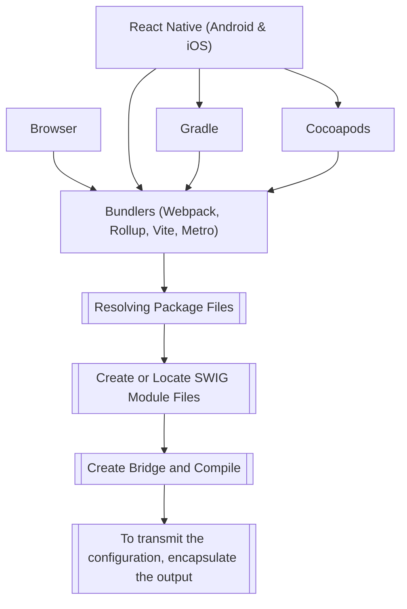

# Overview

```mermaid
flowchart TD
    browser["Browser"] -->
    bundlers["Bundlers (Webpack, Rollup, Vite, Metro)"]
    rn["React Native (Android & iOS)"] -->
    bundlers -->
    depend[["Resolving Package Files"]] -->
    swig[["Create or Locate SWIG Module Files"]] -->
    compile[["Create Bridge and Compile"]] -->
    wrapper[["To transmit the configuration, encapsulate the output"]]
    rn -->
    gradle["Gradle"] -->
    bundlers
    rn -->
    cocoapods["Cocoapods"] -->
    bundlers
```
