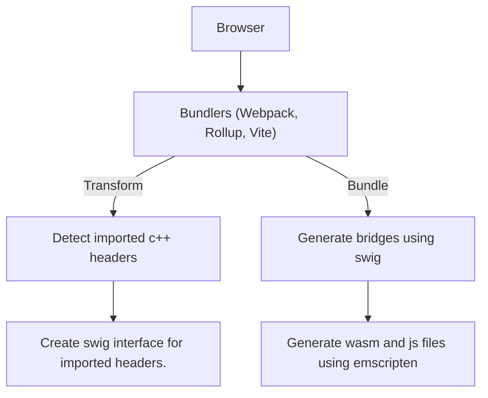
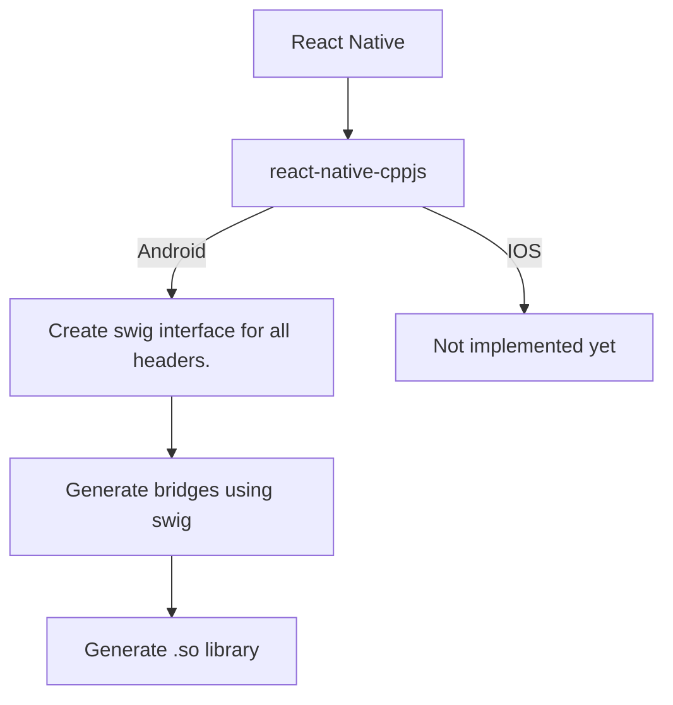
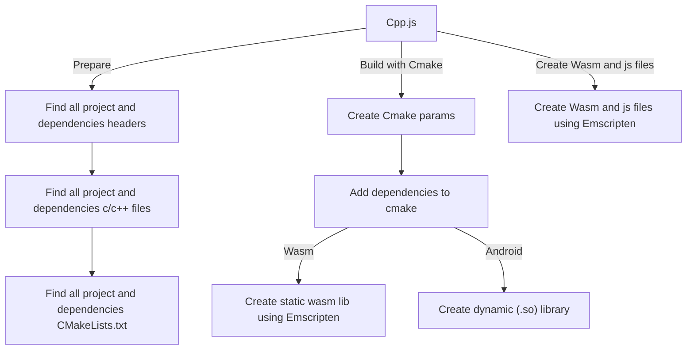

# How it works?

## Docker Image
Cpp.js downloads the bugra9/cpp.js docker image before running. This docker image contains Emscripten, Swig, Cmake and patches prepared for them. 
Thus, the necessary applications can be accessed through this image.

:::note Links
- **Docker Image:** https://hub.docker.com/r/bugra9/cpp.js  
- **Dockerfile:** https://github.com/bugra9/cpp.js/blob/main/packages/cppjs-util-docker/Dockerfile
:::

  

## Browser
Cpp.js performs the binding process in the browser with bundler plugins. These plugins; webpack (cppjs-webpack-plugin, cppjs-loader), rollup (rollup-plugin-cppjs), vite (vite-plugin-cppjs).

During import parsing, the plugins create the swig interface for the imported header files and change the import line to import cpp.js.

During the bundle creation, bridge files are created for the swig interfaces and all codes are compiled to create wasm and js files in the dist directory.

In development mode, wasm and js files are served from the temp directory.

 

:::note Links
- **cppjs-webpack-plugin:** https://github.com/bugra9/cpp.js/blob/main/packages/cppjs-plugin-webpack/index.js 
- **cppjs-loader:** https://github.com/bugra9/cpp.js/blob/main/packages/cppjs-plugin-webpack-loader/index.js

- **rollup-plugin-cppjs:** https://github.com/bugra9/cpp.js/blob/main/packages/cppjs-plugin-rollup/index.js
- **vite-plugin-cppjs:** https://github.com/bugra9/cpp.js/blob/main/packages/cppjs-plugin-vite/index.js
:::

  

## React Native
Cpp.js is designed to bind the same on all platforms. In browsers, embind is used for bind, so embind is also used on React Native.

For this, Embind was moved from Emscripten to a separate package called react-native-embind and the webassembly integration was replaced with JSI. 

The react-native-cppjs package was created for easy integration with React native. This package runs a node script on build.gradle to get the cmake parameters in cpp.js and the path to the CMakeLists.txt file. Using these, the compilation process is performed on the android ecosystem.

 

:::note Links
- **react-native-embind:** https://github.com/bugra9/react-native-embind/tree/main/react-native-embind 
- **react-native-cppjs:** https://github.com/bugra9/react-native-embind/tree/main/react-native-cppjs
- **react-native-sample:** https://github.com/bugra9/cpp.js/tree/main/samples/cppjs-sample-mobile-reactnative
:::

  

## Cpp.js Build
Cpp.js has a config system for customization. Most information such as path of native code, file extensions, dependencies are defined in the cppjs.config.js file in the project directory. If the file does not exist or attributes are not defined, it continues with default values.

Cpp.js prepares the parameters needed for compilation, such as files to be compiled using the values in config.

Compilation is done by giving CMakeLists.txt in cpp.js and the previously prepared parameters to cmake.

As a final step, just for webassembly, the output library is converted into wasm and js files using Emscripten

 

:::note Links
- **cpp.js:** https://github.com/bugra9/cpp.js/tree/main/packages/cppjs-app-cli/src

- **Sample Config:** https://github.com/bugra9/cpp.js/blob/main/samples/cppjs-sample-web-vue-vite/cppjs.config.js
- **getConfig:** https://github.com/bugra9/cpp.js/blob/main/packages/cppjs-app-cli/src/utils/getConfig.js

- **CMakeLists.txt:** https://github.com/bugra9/cpp.js/blob/main/packages/cppjs-app-cli/src/assets/CMakeLists.txt
- **build:** https://github.com/bugra9/cpp.js/blob/main/packages/cppjs-app-cli/src/functions/createWasm.js
:::
 

:::note Samples
- **React Native:** https://github.com/bugra9/cpp.js/tree/main/samples/cppjs-sample-mobile-reactnative
- **Vite + Vue:** https://github.com/bugra9/cpp.js/tree/main/samples/cppjs-sample-web-vue-vite
- **Webpack + React:** https://github.com/bugra9/cpp.js/tree/main/samples/cppjs-sample-web-react-cra

- **Basic Lib** https://github.com/bugra9/cpp.js/tree/main/samples/cppjs-sample-lib-basic
- **Complex Lib:** https://github.com/bugra9/cpp.js/tree/main/samples/cppjs-sample-lib-complex
- **Cmake Lib:** https://github.com/bugra9/cpp.js/tree/main/samples/cppjs-sample-lib-basic-cmake
- **Prebuilt Lib:** https://github.com/bugra9/cpp.js/tree/main/samples/cppjs-sample-lib-basic-prebuilt
:::
